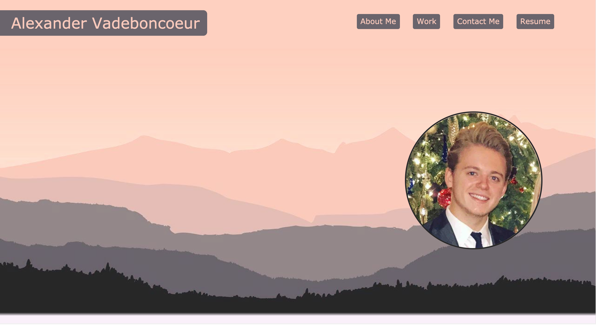
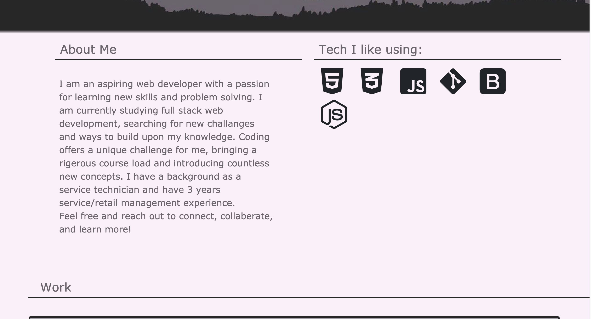
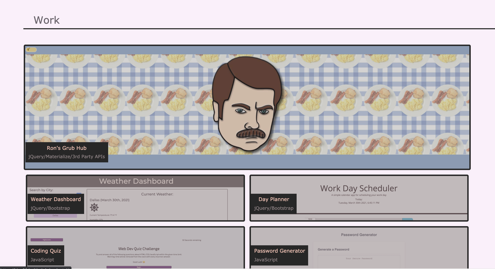
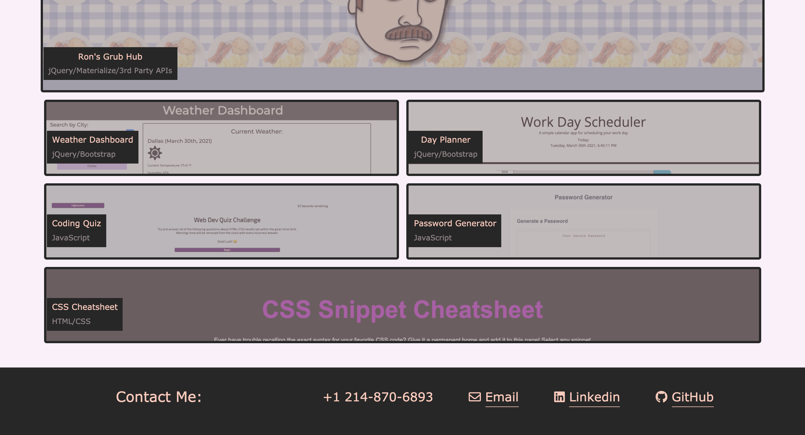

# alexander-vadeboncoeur-portfolio

## Hello! and Welcome to the repo for my online portfolio!

  ###[Click Here to visit my page!](https://alexva397.github.io/alexander-vadeboncoeur-portfolio/#)

This repo contains custom styling and design used to create my site. Feel free to browse around and contact me with any questions. Enjoy!

This portfolio is a breif introduction to myself and the coding work I enjoy doing. 

I display some of my latest works and list tech that I enjoy listing.

I also Include multiple ways to contact me! 

### Future Development
  - I would like to completely redesign the site using bootstrap, creating a coherent and more concise layout. Allowing the viewer to clearly identify Bootstrap in action.
  - Add a Carousel component to display my projects. Starting on a featured piece.
  - Create a contact modal that allows the user to email me from the site.

## Screenshots

