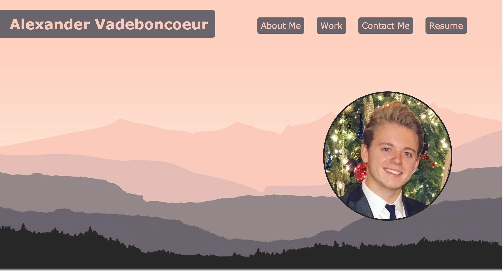
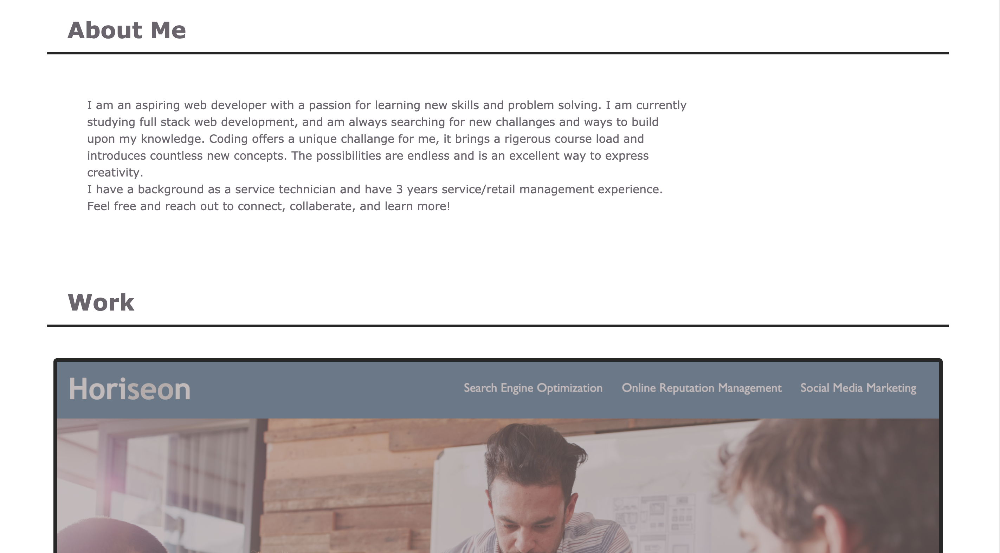
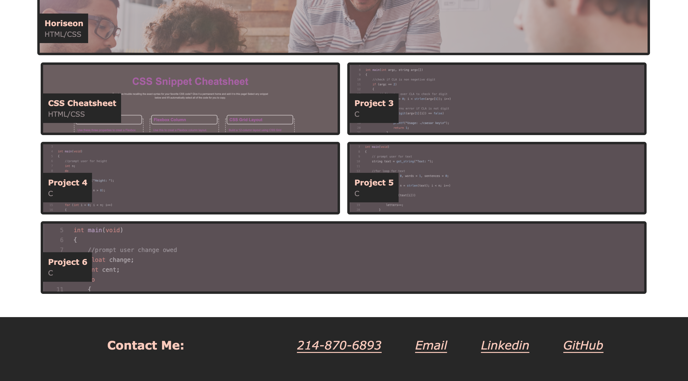
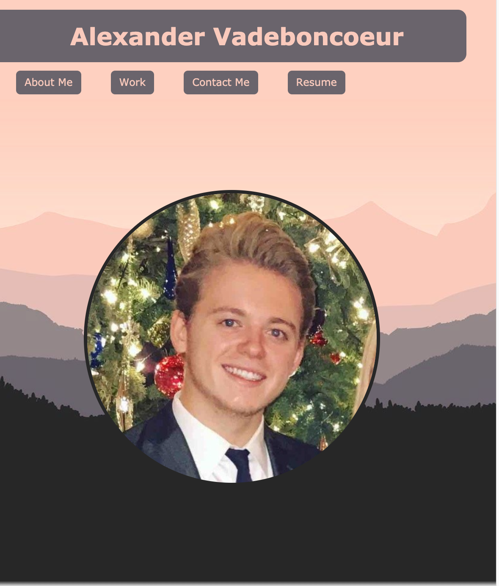
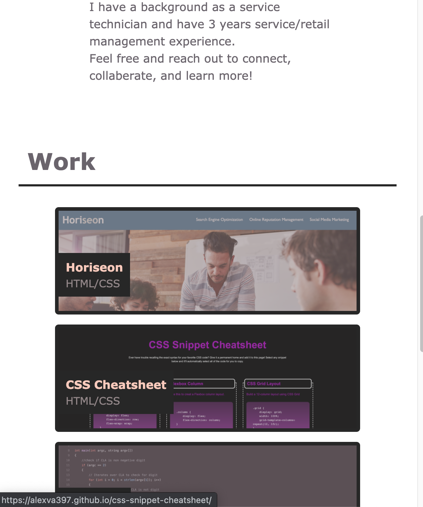

# alexander-vadeboncoeur-portfolio

## Objective
My objective was to create an online portfolio, something that introduces myself and displays my work.

### The portfolio needed to meet the following criteria:
```
GIVEN I need to sample a potential employee's previous work
WHEN I load their portfolio
THEN I am presented with the developer's name, a recent photo, and links to sections about them, their work, and how to contact them
WHEN I click one of the links in the navigation
THEN the UI scrolls to the corresponding section
WHEN I click on the link to the section about their work
THEN the UI scrolls to a section with titled images of the developer's applications
WHEN I am presented with the developer's first application
THEN that application's image should be larger in size than the others
WHEN I click on the images of the applications
THEN I am taken to that deployed application
WHEN I resize the page or view the site on various screens and devices
THEN I am presented with a responsive layout that adapts to my viewport
```

## link
[Alexander Vadeboncoeur Portfolio](https://alexva397.github.io/alexander-vadeboncoeur-portfolio/#)
    
## Implementation    
    -I included links to deployed URLs of previous work and created placeholder objects for future projects to be displayed.
    -I included a navigation bar for easy access to each section within the porfolio.
    -I included links to my online presence, Github, Linkedin, recent resume, and personal contact information.
    -I Created a responsive layout, that sizes and restyles the website based on the viewport.
    -Each project within the work section is displayed as requested.

## Screenshots





